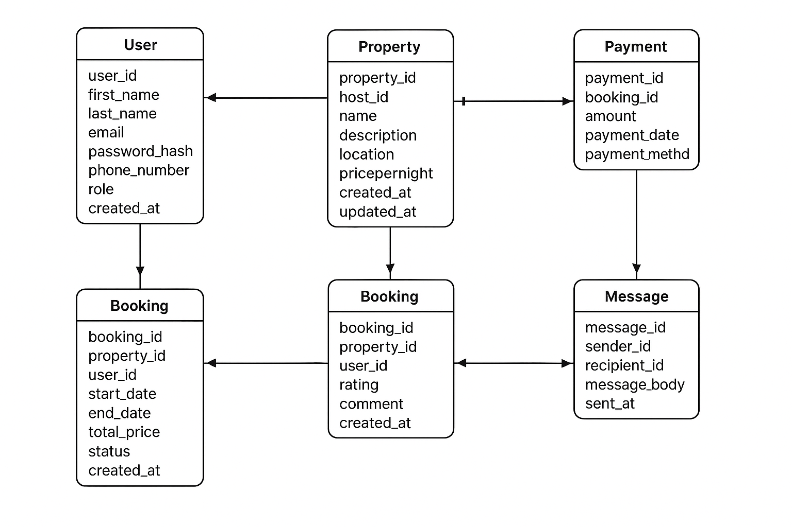

# Task 0: Entity-Relationship Diagram (ERD)

This ERD represents the database design for the **ALX Airbnb Database Project**.

## **Entities**
- **User**: Stores user details (guests, hosts, admins).
- **Property**: Stores property listings by hosts.
- **Booking**: Stores booking details by users.
- **Payment**: Stores payment details linked to bookings.
- **Review**: Stores property reviews by users.
- **Message**: Stores direct messages between users.

## **Relationships**
- A **User** can host many **Properties**.
- A **User** can make many **Bookings**.
- A **Property** can have many **Bookings**.
- A **Booking** has exactly one **Payment**.
- A **User** can leave multiple **Reviews**.
- A **Property** can have multiple **Reviews**.
- Users can send **Messages** to other users.

## **ER Diagram**

